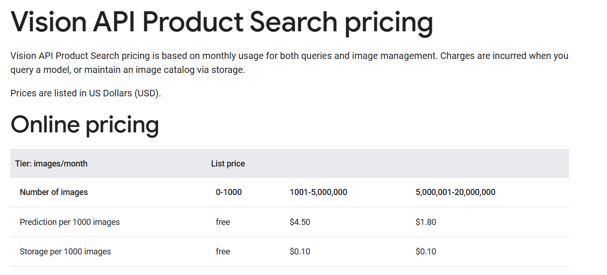

# Google Cloud Vision Product Search AI 
### Prerequisites

## Step 1: Set Up Google Cloud Project

1.  **Create a GCP Project:**

- Go to the [Google Cloud Console](https://console.cloud.google.com/).

- Create a new project or select an existing one.

1.  **Enable APIs:**

- In the Cloud Console, navigate to the API & Services > Dashboard.

- Enable the Vision API and Product Search API for your project.

 3.  **Create Bucket:**

- In the Cloud Console, navigate to the Storage. Create Bucket and Enable Fine Grain Access.

4.  **Set Up Authentication:**

- Create a service account and download the JSON key file.

- Set the environment variable to point to the key file (.env): 

```bash

export PROJECT_ID="" 
export BUCKET=""
export CREDS=""
export SUBFOLDER=""
export PRODUCT_SET=""
export LOCATION=""
export LOCAL_DIR="product_images"
```
  
## Step 2: Create a Product Set

  1. **Create a new folder on your computer to store all your product images (product_image)**

1.  **Initialize Product Search:**

- Install the `pyvisionproductsearch==0.3` Python library:

```bash

pip install pyvisionproductsearch==0.3

```

- Create a Python script to initialize the Product Search client:
 

```python

from pyvisionproductsearch import ProductSearch , ProductCategories
import  os
from  dotenv  import  load_dotenv
ps  =  ProductSearch(
os.getenv("PROJECT_ID"),
os.getenv("CREDS"),
os.getenv("BUCKET"),
os.getenv("LOCATION"),
os.getenv("IMAGE-BUCKET-PREFIX")
)

```

2. **Create a Product Set:**

- Use the script to create a new product set:

```python

product_set  =  ps.createProductSet(os.getenv("PRODUCT_SET"))

```

## Step 3: Add a Product to the Product Set

1.  **Create a New Product:**

- Use the script to create a new product:

```python

product = ps.createProduct('PRODUCT_ID',  "PRODUCT_CATEGORY")
```

2.  **Add a Reference Image:**

- Upload an image of the product to Cloud Storage.

- Add a reference image to the product:

```python

product.addReferenceImage('gs://path/to/product_image.jpg')

```
  
## Step 4: Search for Similar Items

1.  **Perform a Search:**

- Use the Product Search API to search for similar items in your product set:
  

```python

results = product_set.search("PRODUCT_CATEGORY",  image_uri="gs://path/to/query_image.jpg")

```

2.  **Review Results:**

- The `results` variable contains information about matching products.

```python

print(results)

```

- Explore the details of the matched items and their confidence scores.

## Cost :



